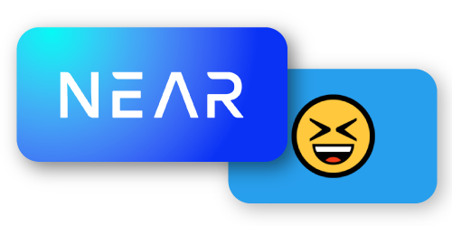
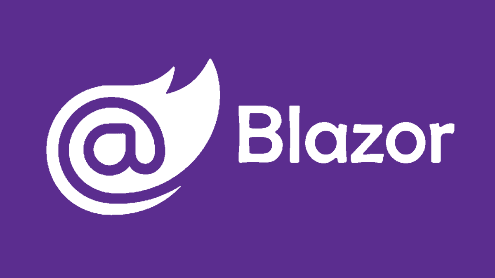
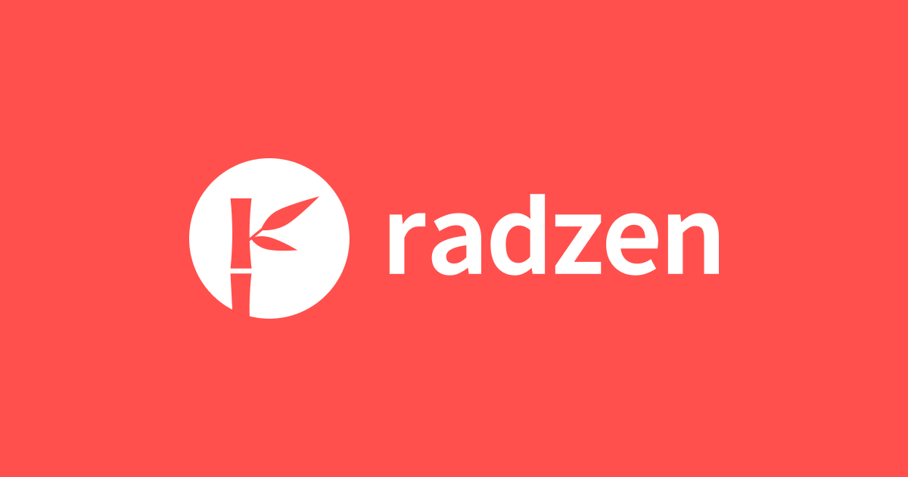

<!-- [![Contributors][contributors-shield]][contributors-url]
[![Forks][forks-shield]][forks-url]
[![Stargazers][stars-shield]][stars-url]
[![Issues][issues-shield]][issues-url]-->

 

  

  <h3 align="center">NEAR XD (😆)</h3>

  

    An awesome NEAR Blockchain explorer
     
  

## About The Project

![NEAR XD Dashboard][DashboardSS]

NEAR XD is a real-time dashboard/explorer for the NEAR Protocol public blockchain 

Here are some cool things that it does:
* It splits blocks by shards, so you can see in real-time the traffic/load distribution inside the network
* It works in real-time by polling at a variable interval (based on the real-time block times) the network to get fresh blocks
* It has an ASP.NET backend that queries the NEAR network, so it can be cost efficient when using paid RPCs

(<a href="#readme-top">back to top</a>)

### Built With

* 
* 
* 

(<a href="#readme-top">back to top</a>)

[DashboardSS]: Resources/Dashboard.png
[AspNetLogo]: Resources/AspNetLogo.png
[BlazorLogo]: Resources/BlazorLogo.png
[RadzenLogo]: Resources/RadzenLogo.png

[contributors-shield]: https://img.shields.io/github/contributors/defikush/NearCompanion.svg?style=for-the-badge
[contributors-url]: https://github.com/defikush/NearCompanion
[forks-shield]: https://img.shields.io/github/forks/contributors/defikush/NearCompanion.svg?style=for-the-badge
[forks-url]: https://github.com/defikush/NearCompanion/forks
[stars-shield]: https://img.shields.io/github/stars/contributors/defikush/NearCompanion.svg?style=for-the-badge
[stars-url]: https://github.com/defikush/NearCompanion
[issues-shield]: https://img.shields.io/github/issues/contributors/defikush/NearCompanion.svg?style=for-the-badge
[issues-url]: https://github.com/defikush/NearCompanion/issues
[license-shield]: https://img.shields.io/github/license/contributors/defikush/NearCompanion.svg?style=for-the-badge
[license-url]: https://github.com/defikush/NearCompanion
